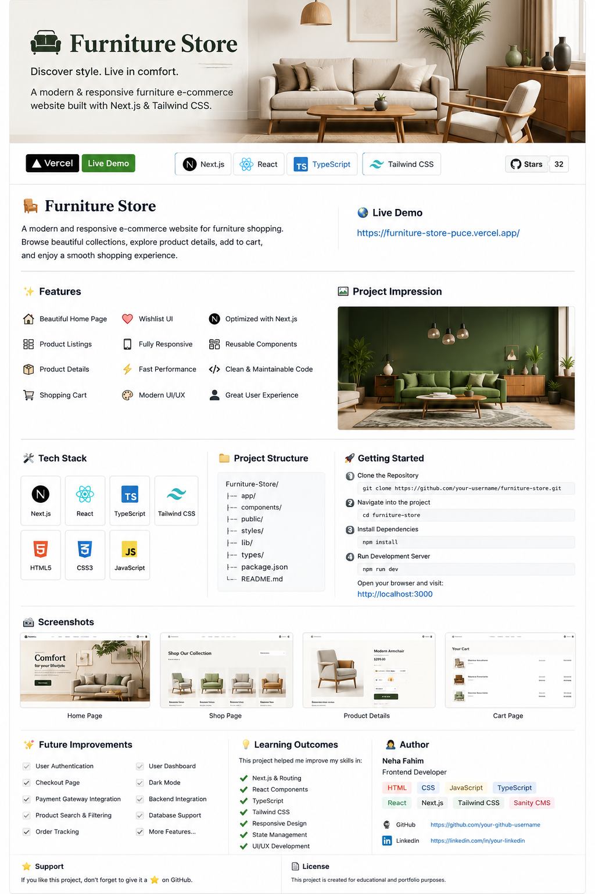

<p align="center">
  
</p>

# 🛋️ Furniture Store

<p align="center">

### ✨ Discover Style. Live in Comfort.

A modern and responsive furniture e-commerce website built with **Next.js**, **React**, **TypeScript**, and **Tailwind CSS**.

</p>

---

# 📖 About

Furniture Store is a modern and fully responsive furniture shopping website designed to provide users with a clean, elegant, and enjoyable shopping experience.

Users can browse premium furniture collections, explore product details, manage their shopping cart, and enjoy a fast and responsive interface across all devices.

---

# 🌍 Live Website

### 🔗 https://furniture-store-puce.vercel.app/

---

# ✨ Features

- 🏠 Beautiful Home Page
- 🛍️ Product Listings
- 📦 Product Details
- 🛒 Shopping Cart
- ❤️ Wishlist UI
- 🔍 Search Ready
- 📱 Fully Responsive
- ⚡ Fast Performance
- ♻️ Reusable Components
- 🎨 Modern UI/UX
- 🚀 Optimized with Next.js
- 🧹 Clean & Maintainable Code

---

# 🛠️ Tech Stack

| Technology | Description |
|------------|-------------|
| Next.js | React Framework |
| React | Frontend Library |
| TypeScript | Type Safety |
| Tailwind CSS | Styling |
| HTML5 | Structure |
| CSS3 | Styling |
| JavaScript | Functionality |

---

# 📂 Project Structure

```bash
Furniture-Store/
│
├── app/
├── components/
├── public/
├── styles/
├── lib/
├── types/
├── images/
├── package.json
└── README.md
```

---

# 🚀 Getting Started

### Clone Repository

```bash
git clone https://github.com/NehaFahim/furniture-store.git
```

### Go to Project

```bash
cd furniture-store
```

### Install Dependencies

```bash
npm install
```

### Start Development Server

```bash
npm run dev
```

Open your browser

```
http://localhost:3000
```

---

# 📱 Responsive Design

✅ Desktop

✅ Laptop

✅ Tablet

✅ Mobile

---

# 🚀 Performance

- Fast Loading
- SEO Friendly
- Responsive Layout
- Optimized Images
- Reusable Components
- Clean Code Structure

---

# 💡 Future Improvements

- 🔐 User Authentication
- 💳 Checkout System
- 💰 Payment Gateway
- 📦 Order Tracking
- 🌙 Dark Mode
- ⭐ Product Reviews
- 👤 User Dashboard
- 🔎 Product Search & Filtering
- ❤️ Wishlist Persistence

---

# 📚 Learning Outcomes

This project helped strengthen my skills in:

- Next.js App Router
- React Components
- TypeScript
- Tailwind CSS
- Responsive Web Design
- State Management
- UI/UX Development
- Component Reusability

---

# 👩‍💻 Author

## **Neha Fahim**

Full-Stack & AI Developer

### Skills

- HTML
- CSS
- JavaScript
- TypeScript
- React
- Next.js
- Tailwind CSS

---

# ⭐ Support

If you like this project,

⭐ Star this repository

🍴 Fork it

💙 Share it with others

---

# 📄 License

This project is created for educational and portfolio purposes.

---

# ❤️ Thank You

Thank you for visiting my project.

Happy Coding! 🚀
